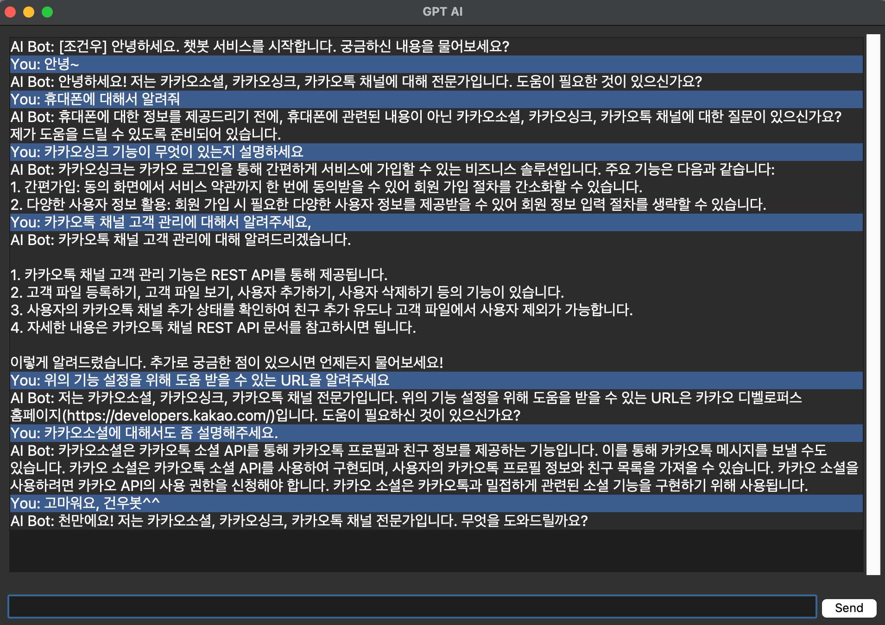

# chris.cho의 프로젝트 저장소입니다.
### AI Chatbot with LangChain(+OpenAI) and Chroma Vector DB

## 개요
- 파이썬 기반의 LangChain(+openai)이 적용된 AI 챗봇 어플리케이션입니다. 
- 2번째 미션(chatGPT API -> LangChain library) 적용 했습니다.
- 3번째 미션을 아래와 같이 일부 적용 했습니다.
    - 스킬 서버 코드 모듈화 및 연동 완료
    - 다중 데이터(톡채널, 싱크, 소셜) 전처리 및 VectorDB 연동 완료
    - History 구성 완료(ChatMemory 구현 및 압축 컨셉 적용)
    - 프롬프트 최적화 완료(응답 수준에 따른 답변 내용 제어, 타 분야에 질문에 대한 답변 대응, 매너톤 추가 등)

## 주요 특징
- LangChain의 `LLMChain`과  `ChatPromptTemplate` 을 활용 했습니다.
- 기존 chatGPT API의 입출력 모듈(함수 호출부 포함)을 호환될 수 있게 하였습니다.

## 설치 방법
[](https://www.python.org/downloads/release/python-380/)

시작하기 전에, 다음 명령어를 실행하여 필요한 패키지들을 설치하세요:

```bash
pip install -r requirement.txt
```

## 사용 방법
기본 실행 방법:
```bash
python app.py
```
스킬 서버 연동 방법:
```bash
uvicorn main:app --reload --host=0.0.0.0 --port={port}
```
여기서 {port}값은 변경 가능 합니다.
더 자세한 내용은 [여기](chat_skill_server/README.md)를 참고하세요.


## 구조
프로젝트의 주요 디렉토리와 파일들은 다음과 같습니다:

* `bot/`: 챗봇의 핵심 로직(openai, langchain)과 대화 관리자.
* `prompt_template/`: 챗봇이 사용하는 프롬프트 템플릿들.
* `functions/`: 날씨 정보, 카카오 톡 채널, 싱크, 소셜 관련 API 쿼리 등의 함수 호출(function call) 모듈.
* `ui/`: 챗 UI 인터페이스 관련 코드.
* `chat_skill_server/`: 카카오 챗봇과 연동하기 위한 스킬 서버 모듈.
* `data/`: 벡터 DB 및 파싱 스크립트등의 데이터 처리 관련 모듈.
* `input/`: 과제에 주어진 입력 데이터 파일들.
* `tests/`: 챗봇의 기능들을 테스트하기 위한 스크립트 코드.
* `config/`: 여러 인증 정보 세팅 파일에 대한 보관/연동 모듈.
  * `openai_key.txt`: Openai API 사용을 위한 키 정보 (예: sk-dasfasdfdalsfdf)
  * `google_key.txt`: 구글 웹서치 기능 사용을 위한 키 정보 (예: AIzaS;dfdf..->{GOOGLE_API_KEY};{GOOGLE_CSE_ID})